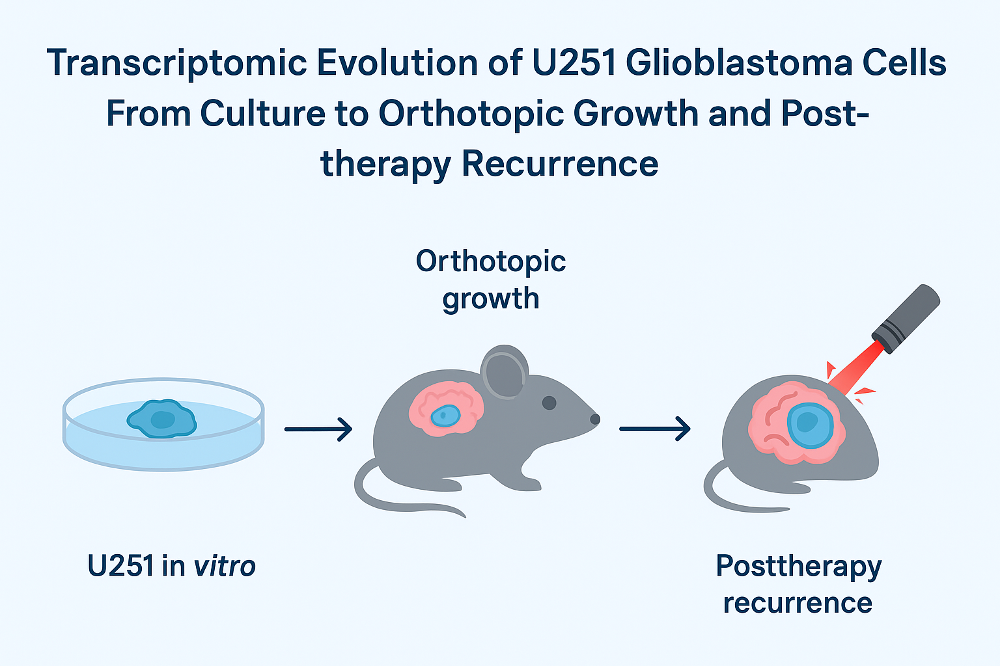

# Transcriptomic Evolution of U251 Glioblastoma Cells: From Culture to Orthotopic Growth and Post-therapy Recurrence



## Project Overview

This project addresses a critical gap in glioblastoma (GBM) modeling: the lack of longitudinal RNA-sequencing (RNAseq) datasets tracking tumor evolution through clinically relevant stages. Specifically, we investigate the transcriptomic shifts of U251 cells from **standard in vitro culture**, to **orthotopic growth** in the murine brain (Primary), and finally through **recurrence following Laser Interstitial Thermal Therapy (LITT)**.

While U251 is a widely used model, classic profiling shows that gene expression shifts substantially when implanted orthotopically, underscoring the dominance of the brain microenvironment. This project aims to quantify these adaptations and define the transcriptional consequences of focal thermal ablation.

---

## Experimental Design & Sample Cohorts

This dataset comprises four distinct biological groups representing the trajectory of tumor evolution and relevant controls.

### 1. In Vitro Culture (Baseline)
* **Sample IDs:** `C2B`
* **Description:** U251 human glioblastoma cells maintained in standard 2D adherent culture (log phase growth) prior to implantation.
* **Purpose:** Serves as the transcriptional baseline to identify genes differentially regulated solely by the transition to the brain microenvironment.

### 2. Primary Orthotopic Xenograft (Pre-LITT)
* **Sample IDs:** `IL64B`, `IL67B`, `IL68B`, `IL69B`
* **Model:** Adult female immunodeficient **RNU/RNU rats**.
* **Implantation:** $5 \times 10^5$ U251 cells stereotactically injected into the **striatum** (Coordinates: 3.5 mm right of bregma, depth 3.0 mm).
* **Tumor Status:** Tumors were allowed to establish and grow for approximately 2 weeks (reaching ~4 mm diameter) as confirmed by MRI and dynamic contrast-enhanced (DCE) imaging prior to intervention.
* **Purpose:** Captures the "brain-adapted" signature, highlighting upregulation of ECM, invasion, and vascular programs absent in plastic culture.

### 3. Recurrent Tumor (Post-LITT)
* **Sample IDs:** `IL66B`, `NL70B`, `NL71B`
* **Ablation Method:** Orthotopic tumors were treated with the **Visualase® clinical LITT system** (Medtronic) using a 980 nm diode laser fiber inserted stereotactically into the tumor center.
* **Parameters:** Ablation was performed under real-time MRI guidance (DWI) using rat-adapted settings (1 Volt, 30–40s duration) to achieve coagulative necrosis of the tumor bulk while creating a sublethal thermal penumbra in the peritumoral tissue.
* **Recurrence:** These samples represent the tumor regrowth harvested longitudinally after the thermal ablation procedure, representing the therapy-resistant subclone or stress-adapted state.

### 4. Control Samples
* **Sample IDs:** `N168B`, `N269B`
* **Description:** Non-tumor brain tissue or procedural controls.
* **Purpose:** Provides a negative control background for normalizing tumor-specific expression and identifying non-specific sequencing artifacts.

### Key Reference for Methodology
The orthotopic tumor model and the specific adaptation of the Visualase LITT system for this dataset are detailed in:

> **Adaptation of laser interstitial thermal therapy for tumor ablation under MRI monitoring in a rat orthotopic model of glioblastoma**
> *Nagaraja TN, Bartlett S, Farmer KG, et al.* (2021)
> [**Read Full Text (PMC)**](https://pmc.ncbi.nlm.nih.gov/articles/PMC8893160/)

---

## Background & Scientific Context

### 1. In Vitro vs. Orthotopic Xenografts
Evidence suggests that the brain microenvironment exerts a dominant influence on transcriptional states.
* **Convergent Profiles:** Gene expression profiles of GBM lines (U251, U87) become more similar to each other—and to patient GBM—in orthotopic settings than in vitro.
* **Key Pathways:** Orthotopic tumors upregulate extracellular matrix (ECM) remodeling, cell adhesion, and angiogenesis, whereas in vitro cultures favor classical proliferation genes.
* **Clinical Relevance:** Orthotopic xenografts cluster closely with patient GBM samples, recapitulating hypoxia and invasion signatures that subcutaneous models fail to capture.

**Key Reference:**
* *Influence of in vivo growth on human glioma cell line gene expression* (Camphausen et al., 2005) - [PNAS Full Text](https://www.pnas.org/doi/10.1073/pnas.0502887102).

### 2. Therapy-Driven Evolution (LITT)
Therapies such as radiation and thermal ablation do not just reduce tumor bulk; they drive selection.

* **LITT Mechanism:** LITT utilizes a laser fiber to deliver thermal energy, creating a central zone of necrosis (>60°C) surrounded by a sublethal thermal penumbra (43-60°C).
    * [Mohammadi & Schroeder, 2014](https://pubmed.ncbi.nlm.nih.gov/24471476/)
* **Penumbra Effects:** Surviving cells in this penumbra experience heat stress, transient blood-brain barrier (BBB) disruption, and hypoxia, likely driving distinct transcriptional states and eventual recurrence.
    * [Nagaraja et al., 2023](https://www.cureus.com/articles/135901-persistent-peri-ablation-blood-brain-barrier-opening-after-laser-interstitial-thermal-therapy-for-brain-tumors#!/)
* **Model Validation:** The Nagaraja et al. model confirms that while LITT achieves near-complete ablation of the central mass, viable tumor cells persist in the periphery, serving as the seed for recurrence.
    * [Nagaraja et al., 2021](https://pmc.ncbi.nlm.nih.gov/articles/PMC8893160/)

### 3. Primary vs. Recurrent GBM Signatures
Matched patient datasets provide a template for analyzing recurrence.
* **Recurrence Signatures:** Recurrent GBM consistently shows upregulation of mesenchymal/stromal programs, myelination, and immune interactions (e.g., Fcγ receptor, complement).
* **Downregulation:** Purely proliferative and cell-cycle pathways are often downregulated in recurrence compared to primary tumors.

**Key Reference:**
* *Multidimensional analysis of matched primary and recurrent glioblastoma...* (2025) - [J Neuropathol Exp Neurol](https://academic.oup.com/jnen/article/84/1/45/7826743).

---

## The Gap: Why This Dataset is Needed

Despite the establishment of LITT as a therapy and U251 as a model, current literature lacks a unified transcriptomic study that:
1.  **Benchmarks** U251 culture-to-brain adaptation at RNAseq resolution.
2.  **Profiles** the orthotopic tumor specifically after LITT focal ablation.
3.  **Longitudinally samples** the recurrence to test for convergence on mesenchymal/stress-tolerant states.
4.  **Simultaneously profiles** the host microenvironment response (stroma/immune) to distinguish tumor-intrinsic evolution from extrinsic tissue scarring.

This repository houses the analysis and data to address this unmet need, integrating differential gene expression and pathway analysis across all three evolutionary stages.

---

## 🚀 Quick Start: Clone to First Run

This section walks the pipeline end-to-end on **Warrior HPC** (WSU), from a fresh clone through the first xengsort job. All commands assume Warrior's SLURM scheduler and a working `mambaforge` install.

### Prerequisites
* WSU Warrior HPC account with SLURM access
* `mambaforge` installed at `$HOME/mambaforge` with a `nextflow` env (see [Software Requirements](#-software-requirements--installation) below)
* Singularity/Apptainer available on compute nodes
* Google Drive OAuth bearer token saved to `~/.gdrive_token` in this format:
    ```bash
    echo 'export GDRIVE_TOKEN="ya29.a0Af..."' > ~/.gdrive_token
    chmod 600 ~/.gdrive_token
    ```

### Step 1 — Clone the repository
```bash
git clone <repo-url> u251-transcriptomic-evolution
cd u251-transcriptomic-evolution
```

### Step 2 — Download raw FASTQs from Google Drive
```bash
cd DATA/RNASEQ/RAW
sbatch download_slurm.sh
```
**What it does:** Sources `~/.gdrive_token`, auto-installs `gdown` if missing, then runs `download_files.sh` to pull the raw paired-end FASTQs into `DATA/RNASEQ/RAW/downloaded_files/`.

**Resources:** `-q primary`, 1 node, 16 GB, walltime 7d.
**Monitor:** `output_<jobid>.out` / `errors_<jobid>.err`; final `checksum_results.log` once `parse_log.py` runs.

### Step 3 — Build reference bundle
```bash
cd ../../../ANALYSIS
sbatch create_refs_final.slurm
```
**What it does:** Runs `create_refs_final.sh` under `r/4.5.0` to populate `ANALYSIS/refs/`:
* `refs/human/` — GENCODE v44 GRCh38 primary assembly FASTA + GTF (MD5-verified)
* `refs/rat/` — Ensembl release 110 mRatBN7.2 toplevel FASTA + GTF (gzip-verified)
* `refs/pathways/human/` — MSigDB v2023.2 (Hallmark, C2, KEGG, GO:BP), DSigDB, BrainGMTv2 human orthologs, plus a deduplicated `combined_human.gmt`
* `refs/pathways/rat/` — Hallmark, GO:BP, KEGG generated via the `msigdbr` R package, plus BrainGMTv2 rat orthologs and `combined_rat.gmt`
* `refs/pathways/human/human_string/` — STRING v12.0 PPI network (taxon 9606): protein links + protein info

**Resources:** `-q primary`, 1 node, 1 CPU, 8 GB, walltime 1h.

### Step 4 — Run xengsort to sort human/rat reads
From the repo root:
```bash
cd ..
sbatch submit_xengsort.sh
```

> **⚠️ Important:** `submit_xengsort.sh` as currently written invokes `nextflow run main.nf -profile singularity -resume` with no `--host_fasta` / `--graft_fasta` / `--input` arguments. `main.nf` hard-errors if those are missing. Edit the final line to:
> ```bash
> nextflow run main.nf -profile singularity \
>     --input  "$(pwd)/ANALYSIS/samplesheet.csv" \
>     --host_fasta  "$(pwd)/ANALYSIS/refs/rat/Rattus_norvegicus.mRatBN7.2.dna.toplevel.fa.gz" \
>     --graft_fasta "$(pwd)/ANALYSIS/refs/human/GRCh38.primary_assembly.genome.fa.gz" \
>     --outdir "$(pwd)/ANALYSIS" \
>     -resume
> ```
> The `host` is rat (background to filter); the `graft` is the human tumor (signal to retain).

**What it does:**
1. `INDEX` — builds the xengsort *k*-mer index on the combined human+rat reference (`k=25`, `n=4.5e9`, `bucketsize=4`, `subtables=15`, `fill=0.85`) and caches it to `ANALYSIS/xengsort_index_clean/` via `storeDir` so it survives `-resume`.
2. `SORT_READS` — per sample, runs `xengsort classify` in `coverage` mode and merges output bins:
    * `*_human_R{1,2}.fq.gz` = `graft` + `both` (graft + conserved reads)
    * `*_rat_R{1,2}.fq.gz` = `host` + `both`
    * `Ambiguous` reads are dropped (PCR-hybrid artifacts, per Zentgraf 2021).
3. `MULTIQC` — aggregates per-sample classification stats into `ANALYSIS/results_therapy/U251_Final_Report.html`.

**Resources:** Pre-pulls the `go2432/xengsort:latest` Singularity image into `$HOME/singularity_cache`, sets `XDG_RUNTIME_DIR=$HOME/xdr` to avoid `/run/user/` permission errors, clears stale `.nextflow/cache/LOCK` files, then launches. Per-process: `INDEX` requests 16 CPU / 80 GB; `SORT_READS` requests 8 CPU / 32 GB.

After Step 4 completes, the sorted FASTQs in `ANALYSIS/sorted_fastqs/` feed directly into the downstream alignment and differential abundance phases described below.

---

## Bioinformatics Workflow: The Dual-Species Strategy

To maximize the utility of the orthotopic xenograft model, this project employs a **Dual-Species Workflow**. Raw sequencing reads are computationally sorted into **Human (Tumor)** and **Rat (Host)** streams, creating two parallel experiments from a single dataset.

| Experiment | **1. Tumor Evolution** | **2. Host Microenvironment** |
| :--- | :--- | :--- |
| **Target Organism** | Human (U251 Cells) | Rat (Brain Stroma/Microglia) |
| **Input Data** | Human-mapping reads | Rat-mapping reads (discarded from Exp 1) |
| **Biological Goal** | Track tumor adaptation & resistance | Track inflammation, gliosis & scarring |
| **Key Contrast** | Primary vs. Recurrent (Resistance) | Tumor vs. Control (Inflammation) |

### Phase 1: Species Sorting with xengsort
**Tool:** [xengsort](https://gitlab.com/genomeinformatics/xengsort) (Zentgraf & Rahmann, 2021) wrapped in a local Nextflow DSL2 pipeline (`main.nf` + `submit_xengsort.sh`).

A critical challenge in orthotopic xenografts is the high sequence conservation between human tumor cells and the rat host brain. Earlier iterations of this project used BBSplit competitive alignment; the current pipeline uses **xengsort**, a *k*-mer-based xenograft sorter that is substantially faster than alignment-based tools and produces explicit `graft` / `host` / `both` / `ambiguous` / `neither` bins per read.

**Why xengsort over BBSplit:**
* *k*-mer hashing (no alignment) → 10–100× faster on equivalent hardware
* Explicit conserved-read bin (`both`) that we *fold back* into both species streams rather than discard, per Conway et al. 2012 and Zentgraf & Rahmann 2021
* Explicit ambiguous bin (`Ambiguous`) for likely PCR-chimera reads that we *exclude*

**Parameters (in `main.nf`):**
* `k=25` (paper optimum for human–mouse; validated for human–rat in this project)
* `n=4.5e9` slots, `bucketsize=4`, `subtables=15`, `fill=0.85`
* `--mode coverage` for classify (writes paired FASTQs per bin)

See [Step 4](#step-4--run-xengsort-to-sort-humanrat-reads) above for the full submit command.

### Phase 2A: Tumor Analysis (Human Reads)
**Tool:** `nf-core/rnaseq` (v3.22.2) → `nf-core/differentialabundance` (v1.5.0)

The sorted `*_human_R{1,2}.fq.gz` files from `ANALYSIS/sorted_fastqs/` are aligned against GRCh38 and quantified with STAR+Salmon, then passed to DESeq2 for differential expression and GSEA.

**Rationale for Contrasts**
1.  **Brain Adaptation** (*Culture vs. Primary*): Defines the "Engraftment Shock." Identifies genes required to transition from plastic to the brain parenchyma.
2.  **Therapy Impact** (*Primary vs. Recurrent*): Defines "Resistance." Isolates the specific transcriptomic shifts driven by thermal ablation and recovery.
3.  **Core Brain Signature** (*In Vitro vs. All In Vivo*): Defines "Invasion." By grouping Primary and Recurrent tumors against Culture, we identify the universal machinery required for U251 survival in the brain, independent of therapy.

```bash
# Step 1: Align human reads
nextflow run nf-core/rnaseq \
    -r 3.22.2 \
    -profile singularity \
    --input "$(pwd)/ANALYSIS/samplesheet.csv" \
    --outdir "$(pwd)/ANALYSIS/results" \
    --fasta "$(pwd)/ANALYSIS/refs/human/GRCh38.primary_assembly.genome.fa.gz" \
    --gtf "$(pwd)/ANALYSIS/refs/human/GRCh38.primary_assembly.annotation.gtf.gz" \
    --skip_bbsplit true \
    --max_cpus 16 \
    --max_memory '64.GB' \
    -resume

# Step 2: Differential abundance + GSEA
nextflow run nf-core/differentialabundance \
    -r 1.5.0 \
    -profile singularity \
    --input "$(pwd)/ANALYSIS/metadata.csv" \
    --contrasts "$(pwd)/ANALYSIS/contrasts.csv" \
    --matrix "$(pwd)/ANALYSIS/results/star_salmon/salmon.merged.gene_counts.tsv" \
    --transcript_length_matrix "$(pwd)/ANALYSIS/results/star_salmon/salmon.merged.gene_lengths.tsv" \
    --gtf "$(pwd)/ANALYSIS/refs/human/GRCh38.primary_assembly.annotation.gtf" \
    --gsea_run \
    --gsea_gene_sets "$(pwd)/ANALYSIS/refs/pathways/human/combined_human.gmt" \
    --gsea_rnd_seed '1234' \
    --gprofiler2_run \
    --gprofiler2_organism hsapiens \
    --study_name "U251_LITT_Evolution" \
    --outdir "$(pwd)/ANALYSIS/results_differential" \
    --shinyngs_build_app \
    --deseq2_min_replicates_for_replace 3 \
    -c gsea_fix.config
```

*Note: `samplesheet.csv` for this phase must point to the xengsort-sorted human FASTQs, not the raw reads.*

### Phase 2B: Host Microenvironment Analysis (Rat Reads)
**Tool:** `nf-core/rnaseq` (re-run on rat reads) → `nf-core/differentialabundance`

Reads identified as "Rat" by xengsort are not discarded but re-analyzed to profile the host response. This "inverted" analysis treats the tumor samples as "Inflamed Brain" and the control samples as "Healthy Brain."

**Rationale for Contrasts**
1.  **Tumor Inflammation** (*Primary Tumor vs. Control Brain*): Identifies microglial activation (*Aif1*), astrogliosis (*Gfap*), and vascular recruitment driven by the tumor presence.
2.  **Ablation Scarring** (*Recurrent Tumor vs. Primary Tumor*): Differentiates the chronic inflammatory signature of the LITT burn scar from the baseline tumor inflammation.

```bash
# Step 1: Align rat reads
nextflow run nf-core/rnaseq \
    -r 3.22.2 \
    -profile singularity \
    --input "$(pwd)/ANALYSIS/samplesheet_host.csv" \
    --outdir "$(pwd)/ANALYSIS/results_host" \
    --fasta "$(pwd)/ANALYSIS/refs/rat/Rattus_norvegicus.mRatBN7.2.dna.toplevel.fa.gz" \
    --gtf "$(pwd)/ANALYSIS/refs/rat/Rattus_norvegicus.mRatBN7.2.110.gtf.gz" \
    --remove_ribo_rna \
    --skip_bbsplit true \
    --max_cpus 16 \
    --max_memory '62.GB'

# Step 2: Differential abundance + GSEA (host)
nextflow run nf-core/differentialabundance \
    -r 1.5.0 \
    -profile singularity \
    --input "$(pwd)/ANALYSIS/metadata_host.csv" \
    --contrasts "$(pwd)/ANALYSIS/contrasts_host.csv" \
    --matrix "$(pwd)/ANALYSIS/results_host/star_salmon/salmon.merged.gene_counts.tsv" \
    --transcript_length_matrix "$(pwd)/ANALYSIS/results_host/star_salmon/salmon.merged.gene_lengths.tsv" \
    --gtf "$(pwd)/ANALYSIS/refs/rat/Rattus_norvegicus.mRatBN7.2.110.gtf" \
    --gsea_run \
    --gsea_gene_sets "$(pwd)/ANALYSIS/refs/pathways/rat/combined_rat.gmt" \
    --gsea_rnd_seed '1234' \
    --gprofiler2_run \
    --gprofiler2_organism rnorvegicus \
    --study_name "U251_Host_Response" \
    --outdir "$(pwd)/ANALYSIS/results_host_differential" \
    --shinyngs_build_app \
    --deseq2_min_replicates_for_replace 3 \
    -c gsea_fix.config
```

---

## 🛠 Software Requirements & Installation

This pipeline uses a containerized infrastructure to ensure reproducibility. The core workflow is managed by **Nextflow**, software dependencies are isolated via **Singularity**, and the local runtime environment is managed by **Mamba**.

### Core Technologies
* **[Nextflow](https://www.nextflow.io/) (v23.10.0+):** Orchestrates data flow, manages SLURM job submissions, and handles error recovery via the `-resume` flag.
* **[Singularity/Apptainer](https://apptainer.org/) (>=v3.6):** Executes the bioinformatics tools (xengsort, STAR, Salmon) within isolated containers to ensure version consistency across cluster nodes.
* **[xengsort](https://gitlab.com/genomeinformatics/xengsort) (Docker: `go2432/xengsort:latest`):** *k*-mer-based xenograft read sorter.
* **[Mamba](https://mamba.readthedocs.io/):** A fast implementation of Conda used to manage the Nextflow installation and environment.
* **[Bioconda](https://bioconda.github.io/):** The software channel providing the bioinformatics-specific packages.

### Setup and Installation

```bash
# 1. Install Mambaforge (if not already present)
wget "https://github.com/conda-forge/miniforge/releases/latest/download/Mambaforge-$(uname)-$(uname -m).sh"
bash Mambaforge-$(uname)-$(uname -m).sh
source ~/.bashrc

# 2. Create the environment from the yml file
mamba env create -f envs/nextflow.yml

# 3. Activate the environment
mamba activate nextflow

# 4. Verify installation
nextflow -v
singularity --version
```

---

## Additional Resources

### Reference Genomes & Databases
All references are downloaded automatically by `ANALYSIS/create_refs_final.slurm` (see [Step 3](#step-3--build-reference-bundle)). Source URLs and provenance below for transparency.

**1. Human Reference (Graft - Tumor)**
* **Assembly:** GRCh38 (GENCODE Release 44)
* **FASTA:** [ftp.ebi.ac.uk](http://ftp.ebi.ac.uk/pub/databases/gencode/Gencode_human/release_44/GRCh38.primary_assembly.genome.fa.gz)
* **GTF:** [ftp.ebi.ac.uk](http://ftp.ebi.ac.uk/pub/databases/gencode/Gencode_human/release_44/gencode.v44.primary_assembly.annotation.gtf.gz)

**2. Rat Reference (Host - Microenvironment)**
* **Assembly:** mRatBN7.2 (Ensembl Release 110)
* **FASTA:** [ftp.ensembl.org](http://ftp.ensembl.org/pub/release-110/fasta/rattus_norvegicus/dna/Rattus_norvegicus.mRatBN7.2.dna.toplevel.fa.gz)
* **GTF:** [ftp.ensembl.org](http://ftp.ensembl.org/pub/release-110/gtf/rattus_norvegicus/Rattus_norvegicus.mRatBN7.2.110.gtf.gz)

**3. Pathway Databases**
* **Human MSigDB v2023.2:** Hallmark, C2 (curated), GO:BP, KEGG (extracted from C2) — [Broad Institute](https://data.broadinstitute.org/gsea-msigdb/msigdb/release/2023.2.Hs/)
* **Human DSigDB (drug signatures):** [Enrichr](https://maayanlab.cloud/Enrichr/geneSetLibrary?mode=text&libraryName=DSigDB)
* **Rat MSigDB (generated):** Hallmark, GO:BP, KEGG generated locally via the R package [`msigdbr`](https://cran.r-project.org/package=msigdbr); no official Rat GMT exists.
* **Brain.GMT v2 (Hagenauer et al., 2024):** [ScienceDirect](https://www.sciencedirect.com/science/article/pii/S2215016124002413)
    * Rat: [BrainGMTv2_RatOrthologs.gmt.txt](https://raw.githubusercontent.com/hagenaue/Brain_GMT/main/BrainGMTv2_RatOrthologs.gmt.txt)
    * Human: [BrainGMTv2_HumanOrthologs.gmt.txt](https://raw.githubusercontent.com/hagenaue/Brain_GMT/main/BrainGMTv2_HumanOrthologs.gmt.txt)

**4. STRING v12.0 PPI Network (Human, taxon 9606)**
* **Protein links:** [stringdb-static.org](https://stringdb-static.org/download/protein.links.v12.0/9606.protein.links.v12.0.txt.gz)
* **Protein info / ID mapping:** [stringdb-static.org](https://stringdb-static.org/download/protein.info.v12.0/9606.protein.info.v12.0.txt.gz)

### Tools & Documentation
* [xengsort (Zentgraf & Rahmann, 2021)](https://gitlab.com/genomeinformatics/xengsort) — [paper](https://academic.oup.com/bioinformatics/article/37/Supplement_1/i17/6319691)
* [nf-core/rnaseq Documentation](https://nf-co.re/rnaseq)
* [nf-core/differentialabundance Documentation](https://nf-co.re/differentialabundance/1.5.0)
* [Visualase® Clinical System Info](https://www.medtronic.com/us-en/healthcare-professionals/products/neurological/laser-ablation-systems/visualase.html)
